# FitVerse — AI-Driven Real-Time Pose Correction & Fitness Recommendation System

## Overview

FitVerse is an AI-driven fitness platform designed to provide real-time exercise pose correction, personalized fitness recommendations, and workout/diet planning.

The system combines a web-based fitness platform with AI-powered pose estimation and a recommendation system to help users improve exercise form and receive personalized fitness guidance.

---

## Project Structure

The project is divided into three main components:

### 1. FitVerse Web

**Web application for the FitVerse platform.**

- Frontend application
- User interface
- Fitness dashboard
- Exercise tracking
- Progress tracking
- Meal planning
- Fitness recommendations

[View FitVerse Web →](./FitVerse/FitVerse_Web)

---

### 2. AI Pose Estimation

**AI-based real-time pose estimation and exercise form analysis.**

- Human pose detection
- Exercise movement analysis
- Real-time pose tracking
- Exercise form correction
- Exercise video analysis

[View AI Pose Estimation →](./pose_correction/AI-Pose-Estimation)

---

### 3. Diet & Workout Planner

**Recommendation system for personalized fitness planning.**

- Workout recommendations
- Diet recommendations
- Personalized fitness planning
- Goal-based recommendations

[View Diet & Workout Planner →](./recommender/Diet_Workout-planner)

---

## Project Architecture

```text
FITVERSE
│
├── FitVerse/
│   └── FitVerse_Web/
│       └── Web Application
│
├── pose_correction/
│   └── AI-Pose-Estimation/
│       └── Real-Time Pose Correction
│
├── recommender/
│   └── Diet_Workout-planner/
│       └── Diet & Workout Recommendation System
│
└── README.md
```

## Screenshots

### FitVerse Web

<table>
<tr>
<td width="50%">

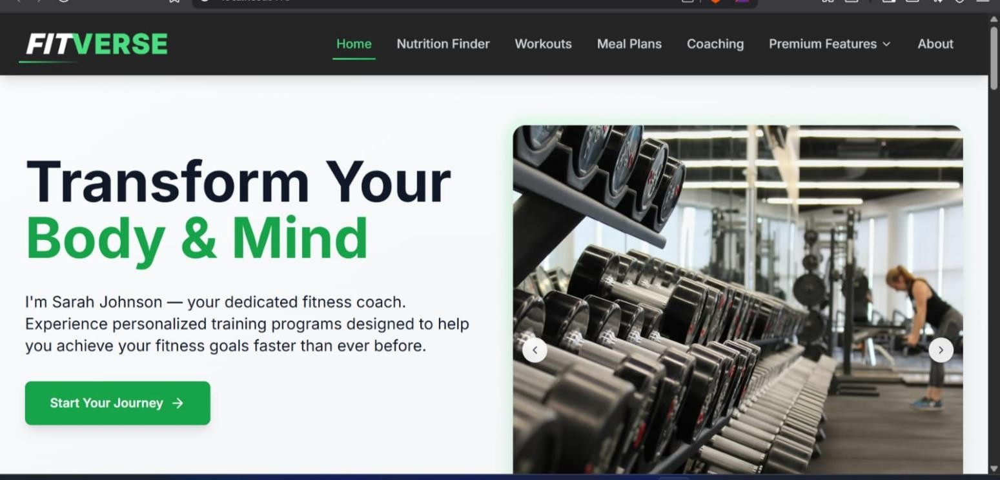

</td>
<td width="50%">

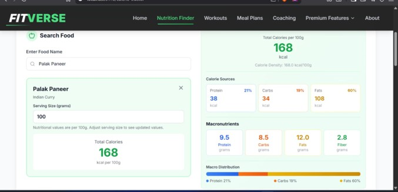

</td>
</tr>

<tr>
<td width="50%">

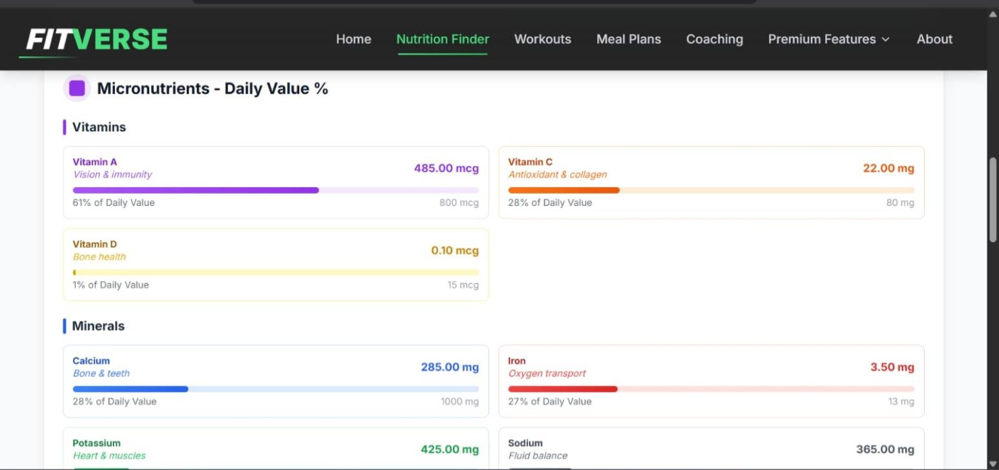

</td>
<td width="50%">

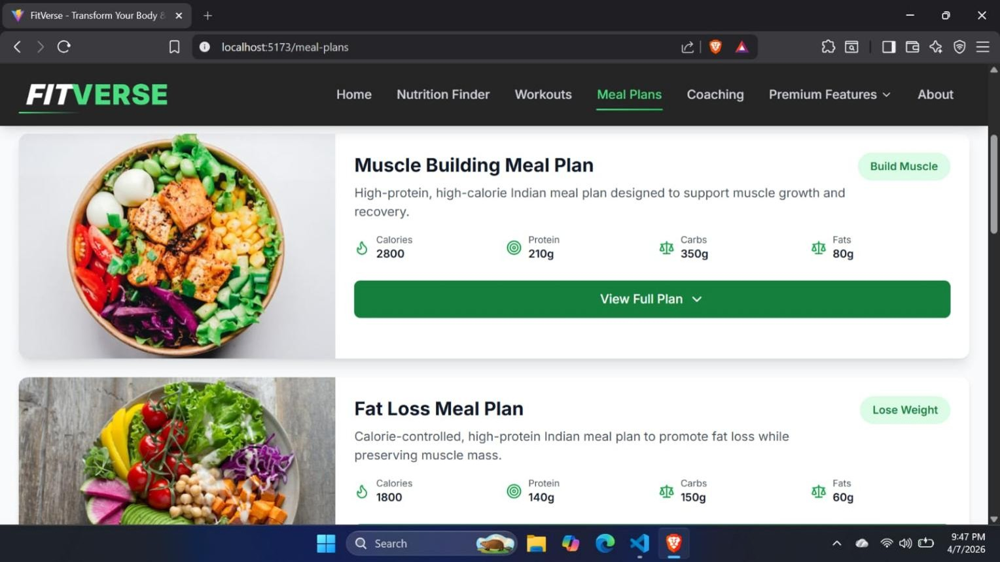

</td>
---
</tr>

<tr>
<td width="50%">

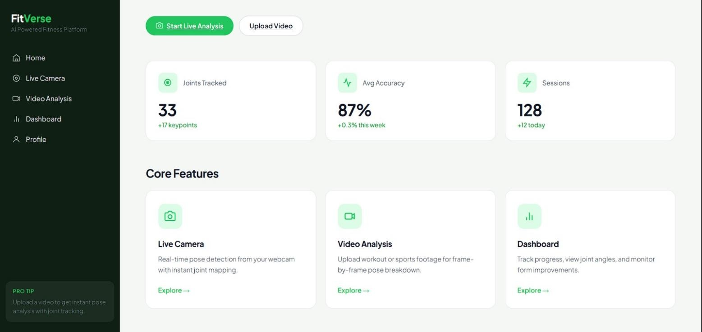

</td>
<td width="50%">

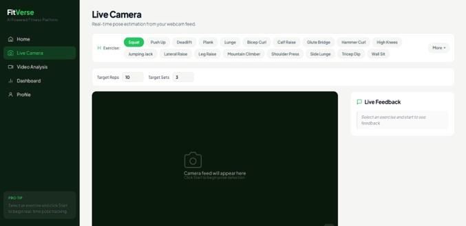

</td>
</tr>

<tr>
<td width="50%">

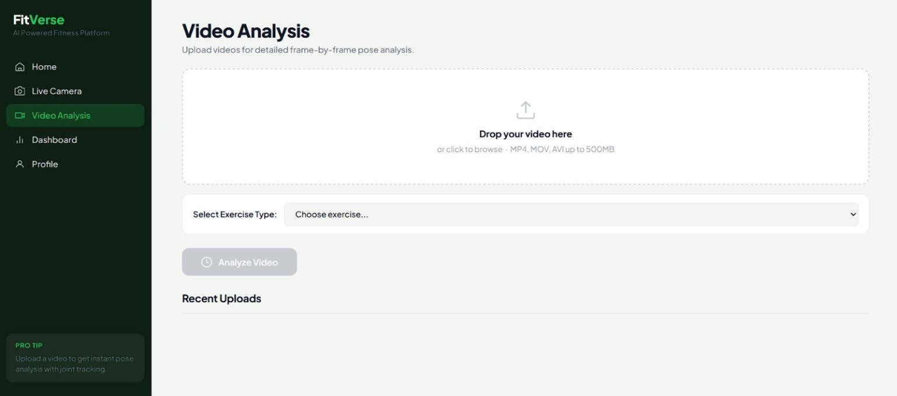

</td>
<td width="50%">

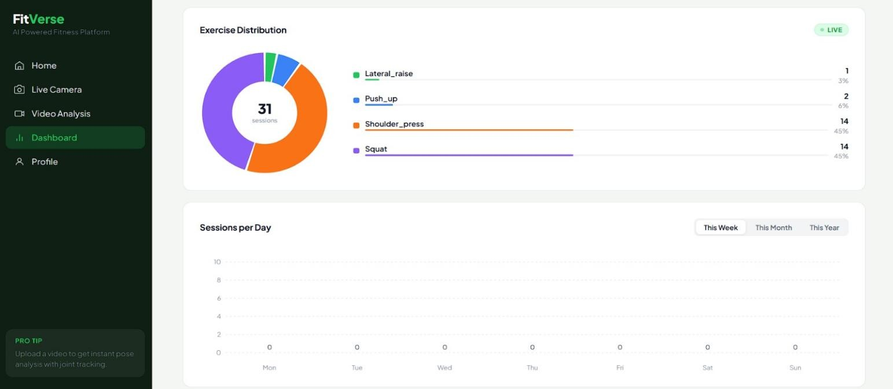

</td>
</tr>

<tr>
<td width="50%">

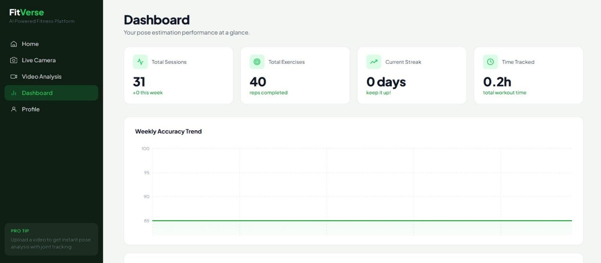

</td>
<td width="50%">

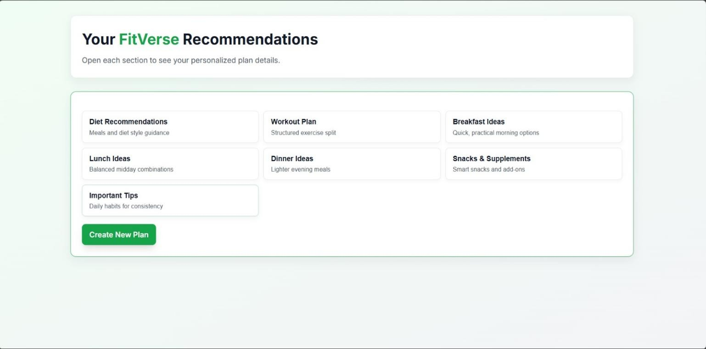

</td>
</tr>

<tr>
<td width="50%">

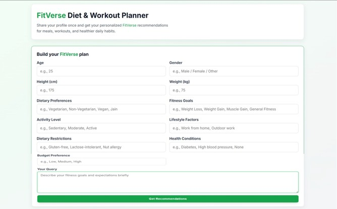

</td>
<td width="50%">

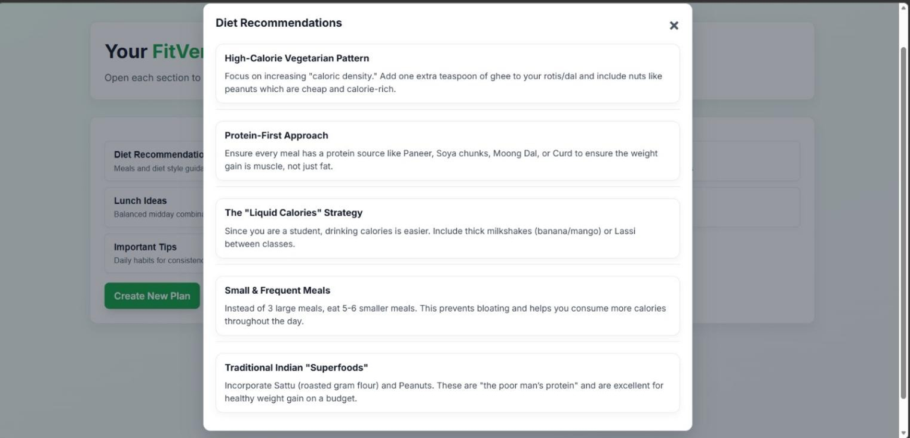

</td>
</tr>
</table>
